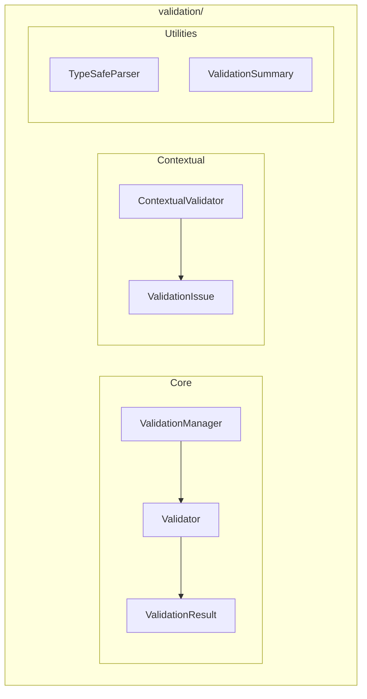

# Validation Module

**Version**: v0.1.0 | **Status**: Active | **Last Updated**: January 2026

## Overview

The Validation module provides a unified input validation framework for the Codomyrmex platform, with support for JSON Schema, Pydantic models, and custom validators.

## Architecture



## Key Classes

| Class | Purpose |
|-------|---------|
| `Validator` | Core validation engine |
| `ValidationManager` | Manage validators |
| `ValidationResult` | Validation result |
| `ValidationWarning` | Warning container |
| `ContextualValidator` | Context-aware validation |
| `ValidationIssue` | Issue details |
| `TypeSafeParser` | Type-safe parsing |
| `ValidationSummary` | Result summary |

## Functions

| Function | Purpose |
|----------|---------|
| `validate()` | Validate data against schema |
| `is_valid()` | Check if data is valid |
| `get_errors()` | Get validation errors |

## Exceptions

| Exception | When Raised |
|-----------|-------------|
| `ValidationError` | General validation error |
| `SchemaError` | Invalid schema |
| `ConstraintViolationError` | Constraint violated |
| `TypeValidationError` | Type mismatch |
| `RequiredFieldError` | Missing required field |
| `RangeValidationError` | Value out of range |
| `FormatValidationError` | Format mismatch |
| `LengthValidationError` | Length constraint |
| `CustomValidationError` | Custom validation |

## Quick Start

### Basic Validation

```python
from codomyrmex.validation import validate, is_valid, get_errors

schema = {
    "type": "object",
    "properties": {
        "name": {"type": "string"},
        "age": {"type": "integer", "minimum": 0}
    },
    "required": ["name"]
}

data = {"name": "John", "age": 30}

# Quick check
if is_valid(data, schema):
    print("Data is valid")

# Full result
result = validate(data, schema)
print(f"Valid: {result.is_valid}")
for error in result.errors:
    print(f"Error: {error.message}")
```

### Validation Manager

```python
from codomyrmex.validation import ValidationManager, Validator

manager = ValidationManager()

# Register validators
manager.register("user", user_schema)
manager.register("config", config_schema)

# Validate
result = manager.validate("user", user_data)
```

### Contextual Validation

```python
from codomyrmex.validation import ContextualValidator

validator = ContextualValidator()

# Context-aware validation
result = validator.validate(
    data=request_data,
    context={"request_type": "create", "user_role": "admin"}
)

for issue in result.issues:
    print(f"[{issue.severity}] {issue.field}: {issue.message}")
```

### Type-Safe Parsing

```python
from codomyrmex.validation import TypeSafeParser

parser = TypeSafeParser()

# Parse with type safety
config = parser.parse(raw_data, target_type=AppConfig)
```

## Integration Points

- **api**: API request validation
- **config_management**: Config validation
- **serialization**: Data validation

## Navigation

- **Parent**: [../README.md](../README.md)
- **Siblings**: [serialization](../serialization/), [api](../api/)
- **Spec**: [SPEC.md](SPEC.md)
