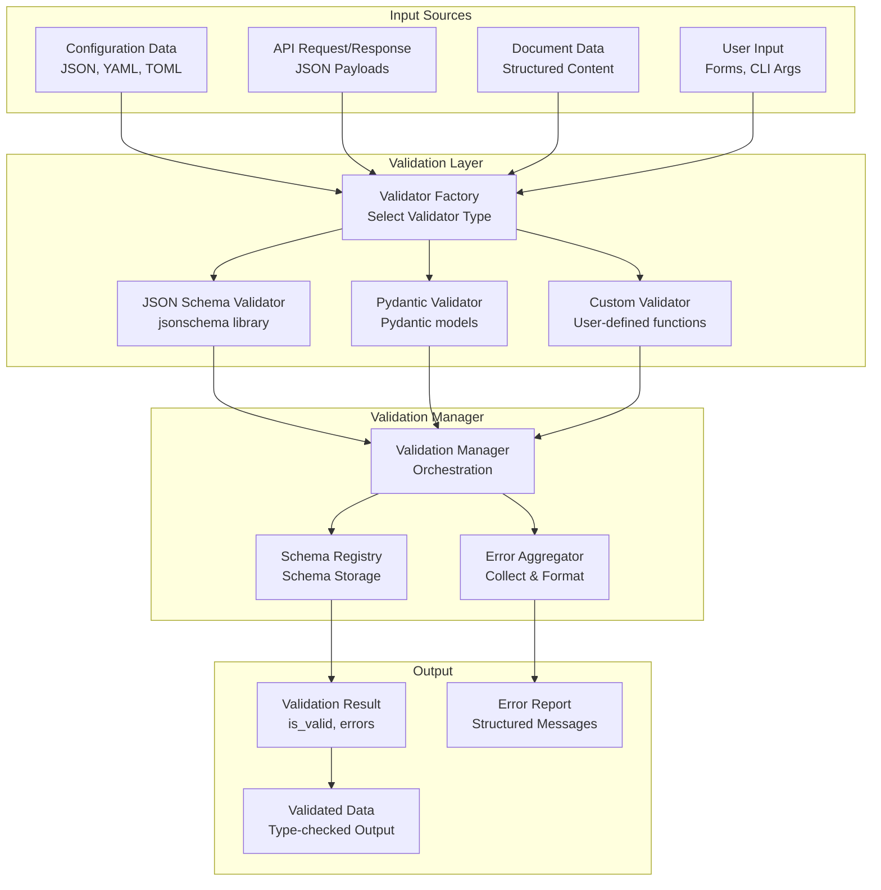
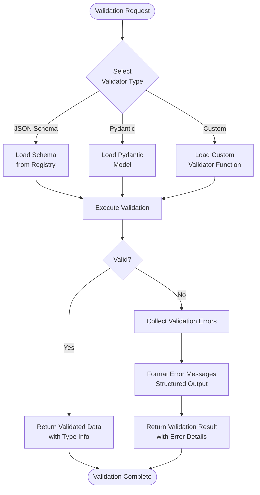

# src/codomyrmex/validation

## Signposting
- **Parent**: [codomyrmex](../README.md)
- **Children**:
    - None
- **Key Artifacts**:
    - [Agent Guide](AGENTS.md)
    - [Functional Spec](SPEC.md)

**Version**: v0.1.0 | **Status**: Proposed | **Last Updated**: December 2025

## Overview

Validation module providing unified input validation framework with support for JSON Schema, Pydantic models, and custom validators for the Codomyrmex platform. This module consolidates validation logic currently scattered across modules.

The validation module serves as the validation layer, providing schema-agnostic validation interfaces with support for multiple validation libraries.

## Validation Architecture



## Validation Flow



## Key Features

- **Multiple Validators**: Support for JSON Schema, Pydantic, and custom validators
- **Schema Validation**: Validate data against schemas
- **Model Validation**: Validate against Pydantic models
- **Custom Validators**: Register and use custom validation functions
- **Error Reporting**: Structured validation error messages

## Integration Points

- **config_management/** - Configuration validation
- **api/** - API request/response validation
- **documents/** - Document schema validation

## Usage Examples

```python
from codomyrmex.validation import Validator, ValidationManager

# Initialize validator
validator = Validator(validator_type="json_schema")

# Validate data against schema
schema = {
    "type": "object",
    "properties": {
        "name": {"type": "string"},
        "age": {"type": "integer"}
    }
}

data = {"name": "John", "age": 30}
result = validator.validate(data, schema)

if result.is_valid:
    print("Validation passed")
else:
    for error in result.errors:
        print(f"Error: {error.message}")

# Validation manager
manager = ValidationManager()
manager.register_validator("custom", custom_validator)
result = manager.validate(data, schema, validator_type="custom")
```

## Navigation
- **Technical Documentation**: [AGENTS.md](AGENTS.md)
- **Functional Specification**: [SPEC.md](SPEC.md)

- **Project Root**: [README](../../../README.md)
- **Parent Directory**: [codomyrmex](../README.md)
- **Related Modules**:
    - [config_management](../config_management/README.md) - Configuration management
    - [api](../api/README.md) - API framework

## Getting Started

To use this module in your project, import the necessary components:

```python
from codomyrmex.validation import Validator, ValidationResult

validator = Validator()
# Use validator for data validation
```

<!-- Navigation Links keyword for score -->

