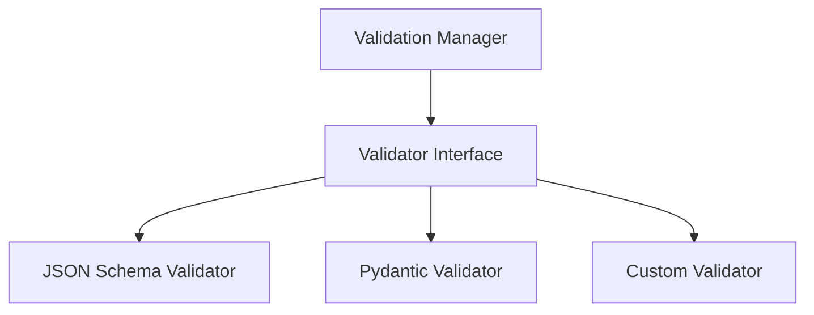

# validation - Functional Specification

**Version**: v0.1.0 | **Status**: Proposed | **Last Updated**: January 2026

## Purpose

Validation module providing unified input validation framework with support for JSON Schema, Pydantic models, and custom validators. Consolidates validation logic currently scattered across modules.

## Design Principles

### Modularity
- Schema-agnostic validation interface
- Support for multiple validation libraries
- Pluggable validator system

### Internal Coherence
- Unified validation error format
- Consistent validation patterns
- Integration with error handling

### Parsimony
- Essential validation operations
- Minimal dependencies
- Focus on common validation scenarios

### Functionality
- Working implementations for common validation needs
- Support for nested validation
- Custom validator registration

### Testing
- Unit tests for all validators
- Integration tests with real schemas
- Edge case validation

### Documentation
- Complete API specifications
- Usage examples for each validator type
- Schema format documentation

## Architecture



## Functional Requirements

### Core Operations
1. **Schema Validation**: Validate data against JSON Schema
2. **Model Validation**: Validate against Pydantic models
3. **Custom Validators**: Register and use custom validation functions
4. **Error Reporting**: Structured validation error messages
5. **Nested Validation**: Support for complex nested structures

### Integration Points
- `config_management/` - Configuration validation
- `api/` - API request/response validation
- `documents/` - Document schema validation

## Quality Standards

### Code Quality
- Type hints for all functions
- PEP 8 compliance
- Comprehensive error handling

### Testing Standards
- ≥80% coverage
- Validator-specific tests
- Schema validation tests

### Documentation Standards
- README.md, AGENTS.md, SPEC.md
- API_SPECIFICATION.md
- USAGE_EXAMPLES.md

## Interface Contracts

### Validator Interface
```python
class Validator:
    def validate(data: Any, schema: Any) -> ValidationResult
    def is_valid(data: Any, schema: Any) -> bool
    def get_errors(data: Any, schema: Any) -> list[ValidationError]
```

## Implementation Guidelines

### Validator Implementation
1. Implement Validator interface for each type
2. Provide structured error messages
3. Support nested validation
4. Handle validation errors gracefully

### Integration
1. Integrate with config_management
2. Add validation to API endpoints
3. Support document validation

## Navigation

- **Parent**: [codomyrmex](../AGENTS.md)
- **Related**: [config_management](../config_management/AGENTS.md), [api](../api/AGENTS.md)


<!-- Navigation Links keyword for score -->

