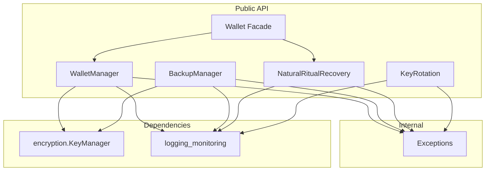

# Wallet - Functional Specification

**Version**: v0.1.7 | **Status**: Active | **Last Updated**: February 2026

## Purpose

The `wallet` module provides secure self-custody key management and Natural Ritual recovery for cognitive agents. It enables autonomous agents to hold, sign with, rotate, and recover cryptographic keys without exposing them to external systems or centralized custodians.

## Design Principles

### Self-Custody

- **Zero Custodian**: Keys are stored locally via the `encryption.KeyManager` and never transmitted externally.
- **Least Privilege**: Only the wallet owner's user_id can access their key material. Backup exports contain hashes, never plaintext keys.

### Natural Ritual Recovery

- **Knowledge-Based Recovery**: Instead of seed phrases or centralized recovery, users prove identity via a series of secret knowledge challenges (memories, experiences, personal facts).
- **ZKP-Like**: The system verifies knowledge of secrets without the secrets being stored in plaintext - only SHA-256 hashes are persisted.
- **All-or-Nothing**: Every step of the ritual must succeed for recovery to grant access.

### Defense in Depth

- **Key Rotation**: Keys can be rotated on schedule or on demand, with full audit trail.
- **Lockout Protection**: Failed recovery attempts are counted and users are locked out after a configurable threshold.
- **Encrypted Backups**: Backup metadata contains key hashes, not raw key material.

## Architecture



## Functional Requirements

### Core Capabilities

1. **Wallet Creation**: Generate wallet IDs and securely store private keys.
2. **Message Signing**: Sign arbitrary messages with HMAC-SHA256 using stored keys.
3. **Signature Verification**: Verify HMAC-SHA256 signatures in constant time.
4. **Key Rotation**: Replace key material while maintaining wallet identity continuity.
5. **Backup Creation**: Generate encrypted backup snapshots with integrity verification.
6. **Natural Ritual Recovery**: Multi-step knowledge-based recovery with lockout protection.
7. **Wallet Deletion**: Securely remove wallet and associated key material.

### Quality Standards

- All key operations go through `encryption.KeyManager` - no direct key handling.
- Key files are stored with 0o600 permissions.
- Backup files contain only hashes, never plaintext key material.
- Recovery responses are compared via SHA-256 hashes only.
- Signature verification uses `hmac.compare_digest` for constant-time comparison.

## Interface Contracts

### Public API - WalletManager

| Method | Signature | Description |
|--------|-----------|-------------|
| `create_wallet` | `(user_id: str) -> str` | Create wallet, return address |
| `get_wallet_address` | `(user_id: str) -> Optional[str]` | Get address by user ID |
| `has_wallet` | `(user_id: str) -> bool` | Check wallet existence |
| `sign_message` | `(user_id: str, message: bytes) -> bytes` | HMAC-SHA256 sign |
| `verify_signature` | `(user_id: str, message: bytes, signature: bytes) -> bool` | Verify signature |
| `rotate_keys` | `(user_id: str, reason: str) -> str` | Rotate and return new address |
| `backup_wallet` | `(user_id: str) -> dict` | Generate backup metadata |
| `delete_wallet` | `(user_id: str) -> bool` | Delete wallet and key |
| `list_wallets` | `() -> Dict[str, str]` | List all wallets |

### Public API - NaturalRitualRecovery

| Method | Signature | Description |
|--------|-----------|-------------|
| `register_ritual` | `(user_id: str, steps: List[RitualStep]) -> None` | Register ritual |
| `initiate_recovery` | `(user_id: str, responses: List[str]) -> bool` | Attempt recovery |
| `has_ritual` | `(user_id: str) -> bool` | Check ritual existence |
| `get_prompts` | `(user_id: str) -> List[str]` | Get ritual prompts |
| `get_remaining_attempts` | `(user_id: str) -> int` | Remaining attempts |
| `is_locked` | `(user_id: str) -> bool` | Check lockout status |
| `reset_attempts` | `(user_id: str) -> None` | Reset attempt counter |
| `unregister_ritual` | `(user_id: str) -> bool` | Remove ritual |

### Public API - BackupManager

| Method | Signature | Description |
|--------|-----------|-------------|
| `create_backup` | `(user_id, wallet_id, metadata) -> dict` | Create backup |
| `list_backups` | `(user_id: str) -> List[dict]` | List user backups |
| `verify_backup` | `(user_id, backup_id) -> bool` | Verify backup integrity |
| `delete_backup` | `(user_id, backup_id) -> bool` | Delete backup |

### Public API - KeyRotation

| Method | Signature | Description |
|--------|-----------|-------------|
| `register_wallet` | `(user_id, wallet_id) -> None` | Register for tracking |
| `record_signature` | `(user_id: str) -> None` | Increment signature count |
| `needs_rotation` | `(user_id: str) -> bool` | Check rotation policy |
| `record_rotation` | `(user_id, old_id, new_id, reason) -> RotationRecord` | Record rotation |
| `get_rotation_history` | `(user_id: str) -> List[RotationRecord]` | Get audit trail |

### Dependencies

- **Internal**: `codomyrmex.encryption.key_manager.KeyManager`, `codomyrmex.logging_monitoring.logger_config`.
- **Standard Library**: `hashlib`, `hmac`, `uuid`, `json`, `datetime`, `pathlib`, `dataclasses`.

## Exception Hierarchy

```
CodomyrmexError
└── WalletError
    ├── WalletNotFoundError  # Wallet/key not found
    ├── WalletKeyError       # Key storage/retrieval failure
    └── RitualError          # Recovery ritual failure
```

## Navigation

- **Human Documentation**: [README.md](README.md)
- **Technical Documentation**: [AGENTS.md](AGENTS.md)
- **API Specification**: [API_SPECIFICATION.md](API_SPECIFICATION.md)
- **Package SPEC**: [../SPEC.md](../SPEC.md)

## Testing

```bash
uv run python -m pytest src/codomyrmex/tests/ -k wallet -v
```
