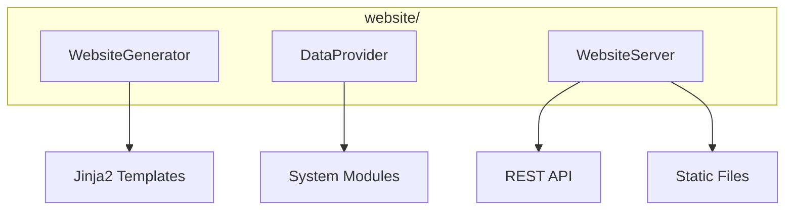

# Website Module

**Version**: v0.1.0 | **Status**: Active | **Last Updated**: January 2026

## Overview

The Website module provides a dynamic web dashboard and control interface for the Codomyrmex ecosystem, serving as a central hub for human interaction with the system's data and operations.

## Architecture



## Key Classes

| Class | Purpose |
|-------|---------|
| `WebsiteGenerator` | Generate static website |
| `DataProvider` | Aggregate system data |
| `WebsiteServer` | HTTP server with API |

## Features

- **Dashboard**: System status, agent counts, environment details
- **Script Execution**: Run scripts from browser
- **Ollama Chat**: AI assistance via local models
- **Configuration Editor**: View/edit configs
- **Documentation Browser**: Navigate docs
- **Pipeline Visualization**: CI/CD monitoring
- **Agent Overview**: List agents with descriptions

## Quick Start

### Generate Website

```python
from codomyrmex.website import WebsiteGenerator

generator = WebsiteGenerator(output_dir="./output/website")

# Generate static files
generator.generate()
```

### Start Server

```python
from codomyrmex.website import WebsiteServer

server = WebsiteServer(port=8080)
server.serve()  # Serves at http://localhost:8080
```

### Data Provider

```python
from codomyrmex.website import DataProvider

provider = DataProvider()

# Get system data
data = provider.get_dashboard_data()
print(f"Agents: {data['agent_count']}")
print(f"Modules: {data['module_count']}")
```

### Custom Templates

```python
from codomyrmex.website import WebsiteGenerator

generator = WebsiteGenerator(
    output_dir="./site",
    template_dir="./custom_templates"
)

generator.add_page("custom.html", context={"title": "Custom"})
generator.generate()
```

## Integration Points

- **system_discovery**: System status
- **agents**: Agent information
- **orchestrator**: Pipeline data

## Navigation

- **Parent**: [../README.md](../README.md)
- **Siblings**: [documentation](../documentation/), [cli](../cli/)
- **Spec**: [SPEC.md](SPEC.md)
