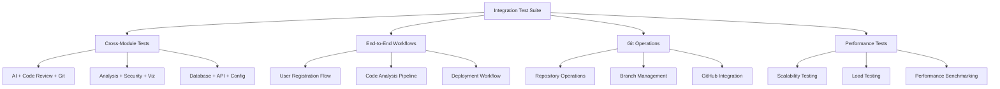

# Codomyrmex Agents — testing/integration

**Version**: v0.1.0 | **Status**: Active | **Last Updated**: December 2025

## Purpose

Integration test suites for the Codomyrmex repository. This directory contains comprehensive integration tests that validate cross-module interactions, end-to-end workflows, and system-level functionality with real data analysis (no mock methods).

The testing/integration directory serves as the validation layer for ensuring Codomyrmex modules work together correctly in production-like scenarios.

## Module Overview

### Key Capabilities
- **Cross-Module Testing**: Validate interactions between different Codomyrmex modules
- **End-to-End Workflows**: Test complete user journeys and system processes
- **Git Integration Testing**: Comprehensive Git and GitHub operations validation
- **Performance Validation**: Integration-level performance and scalability testing
- **Real Data Analysis**: All tests use actual data and implementations

### Key Features
- Multi-module workflow orchestration testing
- Git repository operations and GitHub API integration
- AI code execution and analysis pipeline validation
- Documentation accuracy and completeness testing
- Cross-platform compatibility validation

## Function Signatures

### Cross-Module Workflow Functions

```python
def main() -> None
```

Main entry point for cross-module workflow testing.

**Returns:** None - Executes comprehensive cross-module integration tests

```python
def get_users_from_db() -> list[dict[str, Any]]
```

Retrieve user data from database for testing.

**Returns:** `list[dict[str, Any]]` - List of user data dictionaries

```python
def process_users(users: list[dict[str, Any]]) -> list[dict[str, Any]]
```

Process user data through multiple modules.

**Parameters:**
- `users` (list[dict[str, Any]]): User data to process

**Returns:** `list[dict[str, Any]]` - Processed user data

```python
def save_results_to_file(data: Any, filename: str) -> bool
```

Save test results to file for analysis.

**Parameters:**
- `data` (Any): Data to save
- `filename` (str): Output filename

**Returns:** `bool` - True if successful, False otherwise

```python
def validate_email(email: str) -> bool
```

Validate email format and deliverability.

**Parameters:**
- `email` (str): Email address to validate

**Returns:** `bool` - True if valid email, False otherwise

### Algorithm Testing Functions

```python
def algorithm_a(n: int) -> int
```

Test implementation of algorithm A.

**Parameters:**
- `n` (int): Input parameter

**Returns:** `int` - Algorithm result

```python
def algorithm_b(n: int) -> int
```

Test implementation of algorithm B.

**Parameters:**
- `n` (int): Input parameter

**Returns:** `int` - Algorithm result

```python
def calculate_fibonacci(n: int) -> int
```

Calculate nth Fibonacci number.

**Parameters:**
- `n` (int): Fibonacci sequence position

**Returns:** `int` - nth Fibonacci number

### Security and Analysis Functions

```python
def insecure_function(user_input: str) -> str
```

Test function with security vulnerabilities (for testing purposes).

**Parameters:**
- `user_input` (str): User input to process insecurely

**Returns:** `str` - Processed input (insecurely)

```python
def unused_function() -> None
```

Test function that is intentionally unused (for dead code analysis).

**Returns:** None

### AI Code Execution Functions

```python
def factorial(n: int) -> int
```

Calculate factorial of n.

**Parameters:**
- `n` (int): Number to calculate factorial for

**Returns:** `int` - Factorial result

```python
def broken_function() -> None
```

Intentionally broken function for testing error handling.

**Returns:** None - Raises exception

### Git Operations Functions

```python
def main() -> None
```

Main entry point for comprehensive Git method verification.

**Returns:** None - Runs comprehensive Git method tests

```python
def test_repository(repo_info: dict[str, Any], base_dir: Path) -> dict[str, Any]
```

Test Git repository operations.

**Parameters:**
- `repo_info` (dict[str, Any]): Repository information
- `base_dir` (Path): Base directory for testing

**Returns:** `dict[str, Any]` - Test results

```python
def create_test_files(repo_info: dict[str, Any], timestamp: str, feature_branch: str) -> list[str]
```

Create test files for Git operations testing.

**Parameters:**
- `repo_info` (dict[str, Any]): Repository information
- `timestamp` (str): Timestamp for file naming
- `feature_branch` (str): Feature branch name

**Returns:** `list[str]` - List of created file paths

```python
def test_git_operations() -> dict[str, Any]
```

Execute comprehensive Git operations test suite.

**Returns:** `dict[str, Any]` - Test results and metrics

```python
def get_repository_info() -> dict[str, Any]
```

Get information about test repositories.

**Returns:** `dict[str, Any]` - Repository information

```python
def validate_repository_operations() -> dict[str, Any]
```

Validate Git repository operations and integrity.

**Returns:** `dict[str, Any]` - Validation results

```python
def create_commit_message(repo_info: dict[str, Any], timestamp: str, feature_branch: str) -> str
```

Generate test commit message.

**Parameters:**
- `repo_info` (dict[str, Any]): Repository information
- `timestamp` (str): Timestamp
- `feature_branch` (str): Feature branch name

**Returns:** `str` - Generated commit message

```python
def main() -> None
```

Main entry point for real Git repository testing.

**Returns:** None - Runs Git repository tests

### GitHub Functionality Functions

```python
def test_all_git_operations() -> dict[str, Any]
```

Test all Git operations comprehensively.

**Returns:** `dict[str, Any]` - Operation test results

```python
def test_function() -> str
```

Simple test function for validation.

**Returns:** `str` - Test result string

```python
def demonstrate_github_functionality() -> dict[str, Any]
```

Demonstrate GitHub API functionality and integration.

**Returns:** `dict[str, Any]` - Demonstration results

```python
def show_complete_workflow() -> dict[str, Any]
```

Show complete Git workflow from creation to merge.

**Returns:** `dict[str, Any]` - Workflow execution results

```python
def main() -> None
```

Main entry point for GitHub functionality demonstration.

**Returns:** None - Runs GitHub functionality demo

### Integration Test Functions

```python
def run_integration_tests() -> dict[str, Any]
```

Execute comprehensive integration test suite.

**Returns:** `dict[str, Any]` - Integration test results and metrics

## Data Structures

### IntegrationTestResult
```python
@dataclass
class IntegrationTestResult:
    test_name: str
    success: bool
    execution_time: float
    modules_tested: list[str]
    errors: list[str]
    metrics: dict[str, Any]
    timestamp: datetime
```

Results from integration test execution.

### WorkflowTestData
```python
@dataclass
class WorkflowTestData:
    input_data: Any
    expected_output: Any
    modules_involved: list[str]
    performance_requirements: dict[str, float]
    validation_criteria: dict[str, Any]
```

Test data for workflow validation.

### GitTestRepository
```python
@dataclass
class GitTestRepository:
    path: Path
    remote_url: Optional[str]
    branches: list[str]
    commits: list[dict[str, Any]]
    tags: list[str]
    is_clean: bool
```

Representation of a Git repository for testing.

## Integration Testing Architecture



## Active Components

### Core Integration Tests
- `integration_test.py` – Main integration test runner and coordinator
- `test_cross_module_workflows.py` – Cross-module interaction and data flow testing
- `test_ai_code_execution_flow.py` – AI-powered code execution and analysis testing

### Git and GitHub Integration Tests
- `test_github_functionality_demo.py` – GitHub API and functionality testing
- `test_github_operations_demo.py` – Git operations and GitHub integration
- `test_real_github_repos.py` – Real GitHub repository operations testing
- `verify_all_git_methods_comprehensive.py` – Comprehensive Git method verification

### Specialized Integration Tests
- `test_analysis_security_cicd.py` – Security analysis and CI/CD integration
- `test_comprehensive_improvements.py` – System improvement validation
- `test_documentation_accuracy.py` – Documentation validation and testing
- `test_visualization_performance.py` – Data visualization performance testing

### Documentation and Infrastructure
- `README.md` – Integration testing overview and setup
- `AGENTS.md` – This coordination document

## Operating Contracts

### Universal Integration Testing Protocols

All integration tests within the Codomyrmex platform must:

1. **Real System Testing** - Test actual module interactions, not mocks
2. **End-to-End Validation** - Validate complete user workflows and data flows
3. **Performance Aware** - Include performance metrics and scalability validation
4. **Cross-Platform Compatible** - Work across supported operating systems and environments
5. **Isolated Execution** - Tests should not interfere with each other or production systems

### Integration-Specific Guidelines

#### Cross-Module Testing
- Test realistic data flows between modules
- Validate error propagation and recovery across module boundaries
- Include performance impact assessment of module interactions
- Document integration points and dependencies

#### Workflow Testing
- Test complete user journeys from start to finish
- Include both success and failure scenarios
- Validate data consistency across workflow steps
- Measure end-to-end performance and latency

#### Git Integration Testing
- Test all Git operations with real repositories
- Validate GitHub API integration and rate limiting
- Include authentication and authorization testing
- Test concurrent Git operations and conflict resolution

#### Performance Integration Testing
- Test system performance under realistic load
- Validate scalability of multi-module operations
- Include resource usage monitoring and optimization
- Test performance degradation detection and alerting

## Performance and Scalability Testing

### Load Testing Framework
- Configurable concurrent user simulation
- Resource usage monitoring and alerting
- Performance baseline establishment and tracking
- Scalability bottleneck identification

### Integration Performance Metrics
- Cross-module communication latency
- End-to-end workflow completion time
- Resource utilization under load
- Error rates and recovery time

### Scalability Validation
- Horizontal scaling capability testing
- Database connection pool efficiency
- API rate limiting and throttling validation
- Memory and CPU usage optimization

## Troubleshooting Integration Issues

### Common Integration Test Failures

#### Module Communication Failures
```
Issue: Modules fail to communicate or exchange data
Solution: Check module interface compatibility, validate data serialization, review error handling
```

#### Resource Contention
```
Issue: Tests fail due to resource conflicts or exhaustion
Solution: Implement proper test isolation, add resource cleanup, reduce test parallelism
```

#### Timing and Synchronization Issues
```
Issue: Tests fail due to timing dependencies or race conditions
Solution: Add proper synchronization, implement retry logic, review asynchronous operations
```

#### Environment Inconsistencies
```
Issue: Tests pass locally but fail in CI/CD environment
Solution: Validate environment configuration, check dependency versions, review system requirements
```

## Contributing to Integration Tests

### Adding New Integration Tests
1. Identify integration scenario to test (cross-module workflow, end-to-end process)
2. Create test file following naming conventions (`test_integration_scenario.py`)
3. Implement test functions with proper setup, execution, and validation
4. Add performance monitoring and metrics collection
5. Include comprehensive error handling and recovery testing
6. Document test purpose, requirements, and expected outcomes

### Improving Existing Tests
1. Enhance error scenarios and edge case coverage
2. Add performance benchmarking and optimization
3. Improve test reliability and reduce flakiness
4. Update tests for new module features and capabilities
5. Add better reporting and diagnostic information

## Navigation Links

### Integration Test Suites
- **Main Integration Tests**: [integration_test.py](integration_test.py) - Core integration test runner
- **Cross-Module Tests**: [test_cross_module_workflows.py](test_cross_module_workflows.py) - Multi-module validation
- **AI Code Execution**: [test_ai_code_execution_flow.py](test_ai_code_execution_flow.py) - AI workflow testing

### Git and GitHub Tests
- **GitHub Functionality**: [test_github_functionality_demo.py](test_github_functionality_demo.py) - GitHub API testing
- **Git Operations**: [test_github_operations_demo.py](test_github_operations_demo.py) - Git workflow testing
- **Real Repositories**: [test_real_github_repos.py](test_real_github_repos.py) - Live GitHub testing
- **Git Method Verification**: [verify_all_git_methods_comprehensive.py](verify_all_git_methods_comprehensive.py) - Complete Git validation

### Specialized Tests
- **Security & CI/CD**: [test_analysis_security_cicd.py](test_analysis_security_cicd.py) - Security pipeline testing
- **Documentation**: [test_documentation_accuracy.py](test_documentation_accuracy.py) - Documentation validation
- **Visualization**: [test_visualization_performance.py](test_visualization_performance.py) - Visualization performance

### Platform Navigation
- **Testing Suite**: [../README.md](../README.md) - Testing overview
- **Unit Tests**: [../unit/](../unit/) - Individual component testing
- **Examples**: [../../examples/README.md](../../examples/README.md) - Example implementations

## Agent Coordination

### Integration Test Coordination

When coordinating with other testing systems:

1. **Test Data Management** - Coordinate test data creation and cleanup across test suites
2. **Resource Allocation** - Manage shared resources (databases, APIs, external services)
3. **Result Aggregation** - Combine results from unit, integration, and system tests
4. **Environment Consistency** - Ensure consistent test environments across different test types

### Quality Gates

Before integration test changes are accepted:

1. **Test Execution** - All integration tests pass successfully
2. **Performance Validation** - Performance requirements are met
3. **Cross-Module Compatibility** - Modules integrate correctly without breaking changes
4. **Documentation Updates** - Test changes reflected in documentation
5. **Environment Compatibility** - Tests work across all supported environments

## Version History

- **v0.1.0** (December 2025) - Initial integration testing system with cross-module workflows, Git operations, AI code execution, and comprehensive validation capabilities
